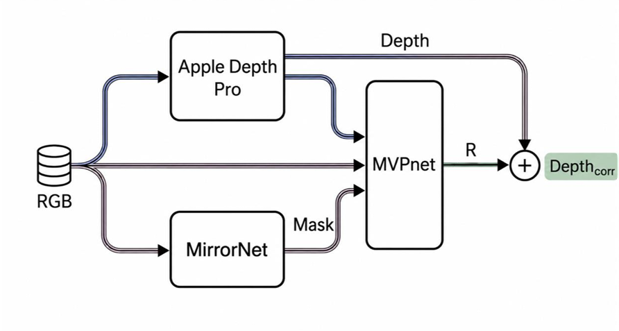
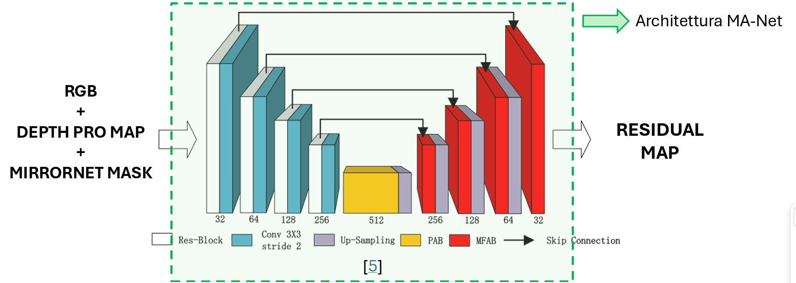
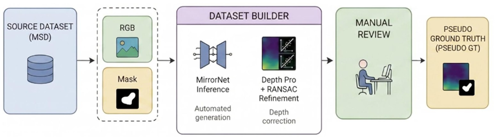

# MVPnet: Mirror-Aware Vision & Depth Prediction Network 🪞📏

## 📖 Overview

State-of-the-art monocular depth estimators, such as **Apple Depth Pro**, perform exceptionally well in standard scenarios but consistently fail when encountering reflective surfaces like mirrors. Instead of estimating the distance to the mirror's surface, these models mistakenly estimate the depth of the reflected scene, causing significant distortions in 3D reconstruction and spatial mapping.

**MVPnet** is a novel architecture designed to solve this problem. By combining the base depth estimation with specialized mirror detection, MVPnet uses a **residual learning** approach to correct the depth map, providing accurate depth values for mirror surfaces without degrading the overall performance of the original depth model.

## 🧠 Global Architecture (Our Solution)

Our pipeline leverages a dual-branch initial stage followed by a residual correction network:

1. **Depth Estimation**: The RGB image is passed through **Apple Depth Pro** to obtain an initial, uncorrected depth map.
2. **Mirror Detection**: The same RGB image is passed through **MirrorNet** to generate a precise mask of the mirrors in the scene.
3. **Residual Correction (MVPnet)**: The RGB image, the uncorrected Depth Map, and the Mirror Mask are concatenated and fed into our custom **MVPnet**.

MVPnet does not predict the final depth directly. Instead, it predicts a **Residual Map (**$R$**)**. The final, corrected depth map ($Depth_{corr}$) is obtained by adding this residual to the original depth map:

$$
Depth_{corr} = Depth + R
$$

<div align="center">
  
</div>

## 🏗️ MVPnet Internal Architecture

The core of our solution is the custom MVPnet model. Its architecture is heavily inspired by **MA-Net**, adapted to process the concatenated inputs (RGB + Depth Pro Map + MirrorNet Mask).

Key components include:
* **Encoder-Decoder Structure**: Utilizes Res-Blocks and $3\times3$ Convolutions (stride 2) for feature extraction and downsampling.
* **Attention Mechanisms**: Integrates advanced attention blocks like **PAB** (Position Attention Block) and **MFAB** (Multi-scale Fusion Attention Block) to focus on the boundaries and context of the mirrors.
* **Skip Connections**: Preserves high-resolution spatial details from the encoder to the up-sampling decoder stages.
* **Output**: A 1-channel Residual Map.

<div align="center">
  
</div>

## ⚖️ Custom Loss Function (Targeted Penalization)

A critical aspect of our training strategy is the custom `ResidualLoss` function. We want MVPnet to act surgically: it must correct the mirror depth without ruining Apple Depth Pro's highly accurate predictions in the rest of the scene.

To achieve this, our loss function is divided into three components, heavily weighting the penalization outside the mirror:

1. **Supervision Loss (**$W_{sup} = 10.0$**)**: Applied *inside* the mirror area. It forces the network to calculate the correct residual $R$ to match our perfectly reconstructed RANSAC target.
2. **Regularization Loss (**$W_{reg} = 30.0$**)**: Applied *outside* the mirror area. **This strictly penalizes the network if it attempts to make any modifications (**$R \neq 0$**) outside the detected mirror.** By giving this loss the highest weight, we guarantee that the original background depth remains untouched.
3. **Smoothness Loss (**$W_{smooth} = 1.0$**)**: Applied only inside the mirror to ensure the corrected depth surface is smooth and continuous.

```python
# Regularization Loss (Outside the real mirror)
# HEAVILY punishes the network if the residual R is non-zero 
# in healthy areas (where mask_perfect is 0)
outside_perfect = 1.0 - mask_perfect
loss_reg = torch.mean(outside_perfect * torch.abs(R))
```

## 📊 Dataset Construction

Training a model to correct mirror depth requires a specialized dataset that provides Ground Truth (GT) for the mirror's true surface distance. Since this data is scarce, we built a custom automated pipeline to generate **Pseudo Ground Truths**, which were then rigorously verified.

**The Pipeline:**
1. **Source Data**: We started with images from the MSD (Mirror Segmentation Dataset).
2. **Automated Generation (`DatasetBuilder.ipynb`)**:
   * We run MirrorNet inference to extract the mirror masks.
   * We use Apple Depth Pro to get the initial depth.
   * We apply **RANSAC Refinement**: By analyzing the depth of the pixels immediately surrounding the mirror (usually a wall), RANSAC fits a 3D plane. We then project this plane over the mirror mask to calculate the true depth of the mirror surface.
3. **Manual Review**: Automated generation isn't perfect. We subjected the generated Pseudo-GTs to a strict manual review process.
4. **Final Dataset**: We successfully obtained approximately **1000 highly accurate, manually reviewed samples** ready for training MVPnet.

<div align="center">
  
</div>

## 🚀 Getting Started

### Prerequisites
* Python 3.8+
* PyTorch
* Requirements listed in `requirements.txt` (if applicable)

### Installation
Clone the repository:
```bash
git clone https://github.com/giulio908/MVPnet.git
cd MVPnet
```

### Dataset Generation
To see how the dataset was built, or to generate your own Pseudo-GTs, check out the Dataset Builder notebook:
```bash
jupyter notebook DatasetBuilder.ipynb
```

## 🤝 Acknowledgments
* [**Apple Depth Pro**](https://github.com/apple/ml-depth-pro) for the baseline robust depth estimation.
* [**MirrorNet**](https://github.com/JialunPeng/MirrorNet) for state-of-the-art mirror segmentation.
* **MA-Net** architecture design which inspired the core of MVPnet.

*Created by [giulio908](https://github.com/giulio908)*